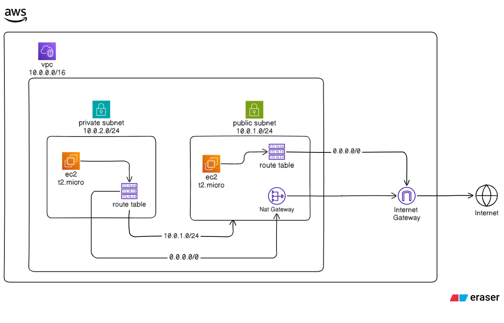

# 🚀 Terraform AWS VPC + EC2 Deployment

This repository contains Terraform configuration to deploy a **custom AWS VPC with public and private subnets**, security groups, and an **EC2 instance in the public subnet**.

---

## 🏗️ Architecture Diagram



---

## 📂 Project Structure

```bash
.
├── assets
│   ├── diagram-old.png
│   └── diagram.png
├── ec2.tf
├── providers.tf
├── terraform.tf
└── readme.md
```


---

## 🧱 Infrastructure Created

This Terraform project creates:

* ✅ Custom VPC (`10.0.0.0/16`)
* ✅ Public Subnet (`10.0.1.0/24`)
* ✅ Private Subnet (`10.0.2.0/24`)
* ✅ Internet Gateway
* ✅ Public Route Table with Internet access
* ✅ Private Route Table (local routing only)
* ✅ Security Groups

  * Allow SSH (22)
  * Allow HTTP (80)
  * Allow HTTPS (443)
* ✅ EC2 Instance (Ubuntu 24.04 LTS)
* ✅ SSH Key Pair for secure access

---

## 🔑 SSH Key Generation

Generate SSH key pair before running Terraform:

```bash
ssh-keygen -t rsa -b 4096 -f terraform-ec2-key
```

This creates:

* `terraform-ec2-key` → Private key (**DO NOT SHARE**)
* `terraform-ec2-key.pub` → Public key (used by Terraform)

---

## ⚙️ Terraform Workflow

### 1. Initialize Terraform

```bash
terraform init
```

---

### 2. Validate configuration

```bash
terraform validate
```

---

### 3. Preview execution plan

```bash
terraform plan
```

---

### 4. Apply configuration

```bash
terraform apply
```

Type:

```bash
yes
```

Terraform will create:

* VPC
* Subnets
* Internet Gateway
* Route Tables
* Security Groups
* EC2 instance

---

### 5. Connect to EC2

```bash
ssh -i terraform-ec2-key ubuntu@<public-ip>
```

---

### 6. Destroy infrastructure

To avoid AWS charges:

```bash
terraform destroy
```

---

## 💰 Cost

This setup is **Free Tier eligible**, including:

* t2.micro instance
* 12GB gp3 storage
* VPC, subnets, IGW, route tables

Expected cost: **$0/month (Free Tier)**

---

## ⚠️ Important Notes

Ensure `.gitignore` contains:

```gitignore
.terraform/
*.tfstate
*.tfstate.backup
terraform-ec2-key
terraform-ec2-key.pub
```

---

## 🎯 Learning Objectives

This project demonstrates:

* Terraform basics
* AWS VPC creation
* Public and private subnet design
* Internet Gateway configuration
* Security Group configuration
* EC2 deployment using Terraform
* Infrastructure as Code (IaC) best practices

---

## 👨‍💻 Author

Travis Fernandes

DevOps Engineer | Terraform | AWS | Docker | Linux

---

## ⭐ Future Improvements

* Add NAT Gateway
* Add Private EC2 instance
* Add Load Balancer
* Add Auto Scaling
* Convert into production-ready 3-tier architecture
