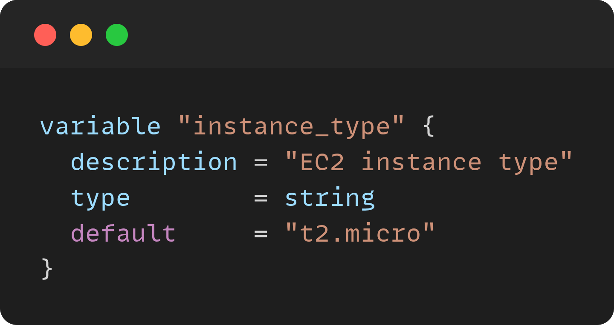
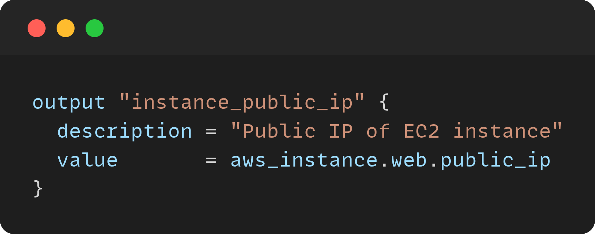
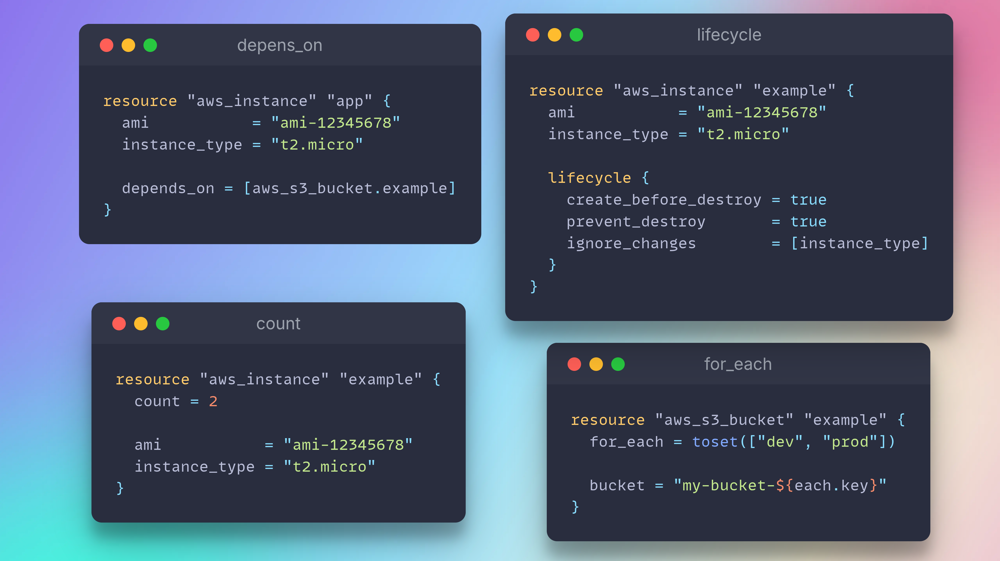

# Variable Syntax

## Basic Syntax

```hcl
variable "<variable_name>" {
  description = "Description of the variable"
  type        = <type>
  default     = <default_value>  # optional
}
```

---

## Example



# Output Syntax

## Basic Syntax

```hcl
output "<output_name>" {
  description = "Description of the output"
  value       = <expression>
}
```

---

## Example


# meta arguments

